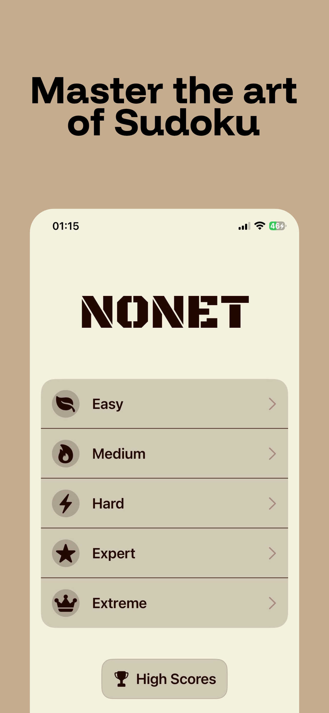
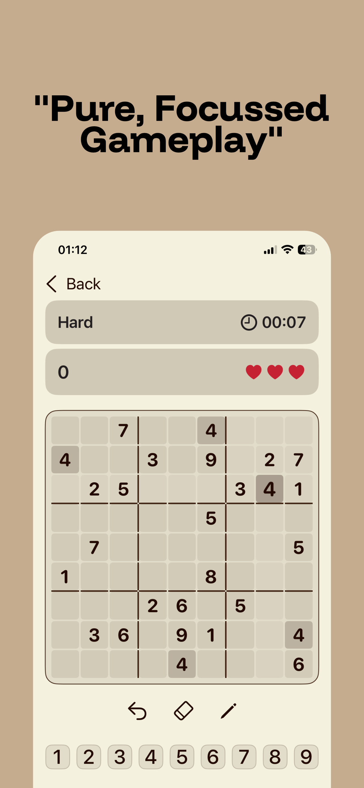
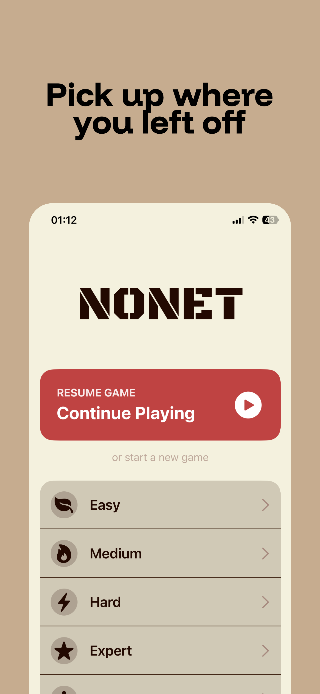
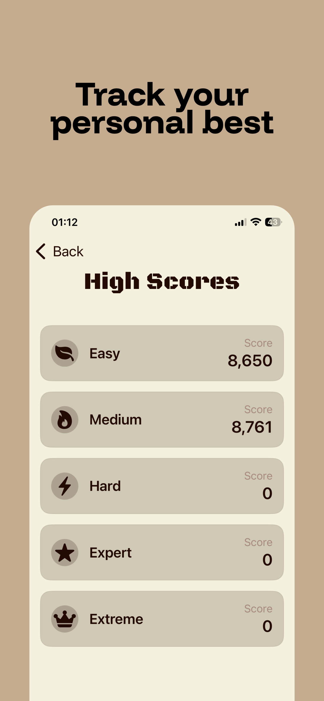

# Nonet

**Nonet** is a modern, beautifully designed Sudoku game for iOS. Challenge your mind with classic gameplay wrapped in a clean, distraction-free interface. Whether you're a beginner or a seasoned pro, Nonet offers a seamless puzzling experience.

## Features

- **Classic Sudoku Gameplay:** Enjoy the timeless logic puzzle in its purest form.
- **Multiple Difficulty Levels:** Choose from various difficulties to match your skill level.
- **Resume Game:** Never lose your progress. Use the "Resume Game" feature to pick up right where you left off.
- **High Scores:** Track your best times and challenge yourself to improve.
- **Modern Interface:** Experience a sleek, dark-themed design with custom aesthetics (`Black Ops One` font) that makes playing a joy.
- **Smart Assists:** Helpful features like highlighting valid moves and tracking remaining numbers.

## Screenshots

  
  
  
  
  

## Installation

Nonet is an iOS application. To run it:

1. Clone this repository.
2. Open `Nonet.xcodeproj` in Xcode.
3. Select your target simulator or device.
4. Build and run (Cmd + R).

## Requirements

- iOS 15.0+
- Xcode 13.0+

## License

This project is licensed under the MIT License.